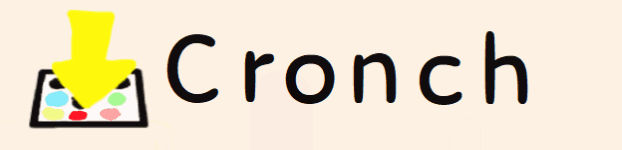

# Cronch

### Cronch is a sprite sheet creator inspired by [crunch](https://github.com/ChevyRay/crunch) (I actually made it because I could not get it working)

## Usage:

1: Choose the files you want to add by clicking `add images`

2: Select your files and press `ok`

3: To remove the files select the name of the file and click the `remove image` button

4: Set the `rows` and `columns` (rows are how many images up, columns are how many images to the side)

5: Click `Cronch`

6: Tweak the rows and columns untill all the images how up correctly

7: Click `Save`

8: Select your folder and press `ok`

9: The spritesheet is created as `SpriteSheet.png`

10: Your done! :D

## Notes:

All images have to be the same size

## Upcoming Features:

All images can bu differnt sizes

Sprite rotation

Animation viewer

Better algorithm for packing sprites

# If used in a project, credit is not needed but would be nice :)

## Changelog:

**1.0.3**: 
(hopefully)fixed a bug that would break the progress bar and stop the program

**1.0.2**:  
changed temp directory to `C:\Users\name\AppData\Roaming\CronchTemp\` 
added multi-select images and removal 
changed `folderBrowserDialogue` to a `saveFileDialogue`

**1.0.1**: 
fixed error (read desc of commit fe84746)

**1.0.0**: 
first Commit
